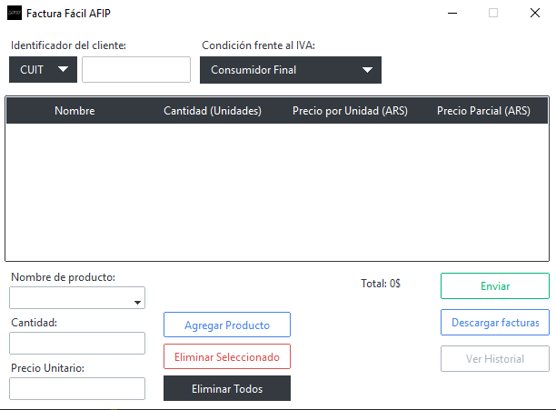
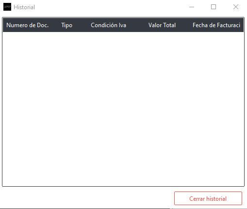

# Factura Fácil AFIP

FacturaFacilAFIP es una aplicación para emitir facturas electrónicas a través de los servicios web de la AFIP (Administración Federal de Ingresos Públicos).

[](https://opensource.org/licenses/)

## Screenshots

<p align="center">
  
  
</p>

## Como ejecutar localmente

Clone the project

```bash
  git clone git@github.com:MojeZcg/FacturaFacilAFIP.git
  cd FacturaFacilAFIP
```

Create an enviroment and activate it

```bash
  python -m venv venv
  .\venv\Scripts\activate
```
Or Linux or Mac.

```bash
  python -m venv venv
  source venv/bin/activate
```

Install dependencies

```bash
  pip install -r .\requirements.txt
```

Start the app (the database is created by running main.py)

```bash
  python main.py
```


## Como Desplegar

Para desplegar, debe generar un archivo .spec con pyinstaller

```bash
  pyinstaller --onefile --name FacturaFacilAfip --icon=static/afip.ico --add-data ".env:." --add-data "static:static" --add-data "LICENSE:." main.py
```


## Variables de entorno

Para ejecutar este proyecto, deberá agregar las siguientes variables de entorno a su archivo .env. O use el .iss para crear la configuración.

`AFIP_CUIL`

`AFIP_KEY`

`DOWNLOAD_PATH`

`DRIVER_PATH`


## Ejecutar Lint

Para ejecutar el lint, instale las dependencias y pylint.

```bash
  pip -r requirements.txt
  pip install pylint
```

luego ejecuta pylint.

```bash
  pylint **/*.py
```


## Contribuciones

¡Las contribuciones siempre son bienvenidas!

Consulte `contributing.md` para conocer las formas de contribuir.

Siga el `code of conduct` de este proyecto.

#### Para empezar:
1. Hacer un fork del repositorio.
2. Crear una nueva rama con tu funcionalidad o corrección:
```bash
git checkout -b nueva-funcionalidad
```
3. Hacer commit de los cambios:
```bash
git commit -am 'Añadir nueva funcionalidad'
```

4. Push:
```bash
git push origin nueva-funcionalidad
```

5. Crear un Pull Request en GitHub.


## Licencia
#### Este proyecto está bajo la Licencia [GPL v3](https://www.gnu.org/licenses/gpl-3.0.en.html#license-text). Para más detalles, ver el archivo [LICENSE](LICENSE).
